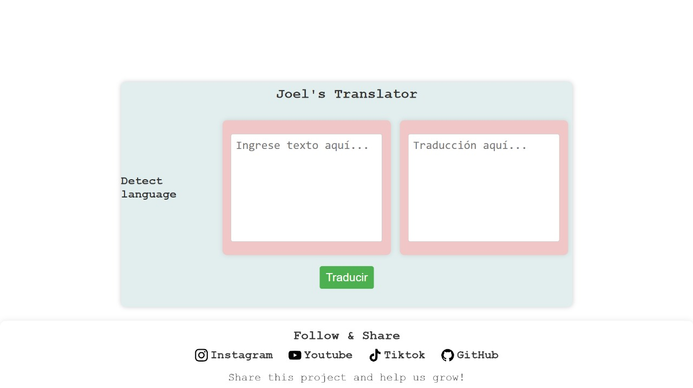

<div align="center">
  <h1>🌐 Translator Web App</h1>
  <p>Automatically translates text to Spanish by smartly detecting the source language. The detected language name and loader are always shown at the top left of the input box.</p>
  
</div>

---

<details>
<summary><strong>Main Features</strong></summary>

- 🚀 Automatic input language detection (Google API)
- 📝 Instant translation to Spanish from any supported language
- 💡 Simple and minimalist interface
- ⏳ Fixed loader next to the detected language name
- 🌍 Shows detected language in readable English names

</details>

---

## 📁 Project Structure

```text
index.html
css/
  style.css
js/
  script.js
assets/
  images/
    logo.png
    screenshot-app.jpg
README.md
```

## 🧑‍💻 Quick Start

1. Type or paste the text you want to translate in the input area.
2. Click the <strong>Translate</strong> button.
3. The system will automatically detect the language, display it (in English), and translate the text to Spanish.
4. While processing, you'll see a minimalist loader fixed next to the detected language name.

## 🛠️ Technologies & Code Structure

- <strong>HTML5</strong>, <strong>CSS3</strong>, <strong>JavaScript</strong>
- Google API for language detection and translation
- All variables and functions are named in English for clarity and maintainability.

## 🎨 Customization

- You can add more languages to the global <code>LANGUAGE_NAMES</code> mapping in <code>js/script.js</code>.
- The loader can be customized in <code>css/style.css</code> and stays fixed next to the language name.

## 👨‍💻 Credits

Developed by <b>Joel Lertua Coico</b>, username <b>SebasXP25</b>.

## 🖼️ Example Usage

<div align="center">
  <iframe width="400" height="225" src="https://www.youtube.com/embed/uk2Mzm_V8IA?rel=0" title="Demo Translator" frameborder="0" allowfullscreen style="border-radius:12px;box-shadow:0 2px 12px #0002;"></iframe>
</div>


1. Enter text in any language in the input area.
2. Click <strong>Translate</strong>.
3. The detected language will appear above (in English) and the Spanish translation will be shown in the output box.
4. While processing, you'll see a loader at the top right of the detected language name.

## 🛡️ Error Messages

If an error occurs during detection or translation, messages will be shown in Spanish to maintain the app's style:

- <code>La traducción ha fallado.</code>
- <code>Idioma desconocido</code>

## 🚀 Local Deployment

```bash
git clone https://github.com/JoelCoico25/Translator
cd Translator
```

Open <code>index.html</code> in your preferred browser. That's it! No additional installation required.

---

## 🌐 Follow & Share

<div align="center">
  <a href="https://www.instagram.com/j.lertua2019/" target="_blank" title="Instagram" style="margin:0 10px; text-decoration:none;">
     <span style="vertical-align:middle; font-weight:bold; color:#E4405F;">Instagram</span>
  </a>
  <a href="https://www.youtube.com/@SebasXP25" target="_blank" title="YouTube" style="margin:0 10px; text-decoration:none;">
     <span style="vertical-align:middle; font-weight:bold; color:#FF0000;">Youtube</span>
  </a>
  <a href="https://www.tiktok.com/@sebasxp25" target="_blank" title="TikTok" style="margin:0 10px; text-decoration:none;">
     <span style="vertical-align:middle; font-weight:bold; color:#000;">Tiktok</span>
  </a>
  <a href="https://github.com/JoelCoico25" target="_blank" title="GitHub" style="margin:0 10px; text-decoration:none;">
     <span style="vertical-align:middle; font-weight:bold; color:#333;">Github</span>
  </a>
  <div style="margin-top:14px; font-size:0.95rem; color:#333;">Share this project and help us grow!</div>
</div>

---

<div align="center">
  <sub>Ready to use and improve! If you have suggestions or find bugs, feel free to contribute.</sub>
</div>
